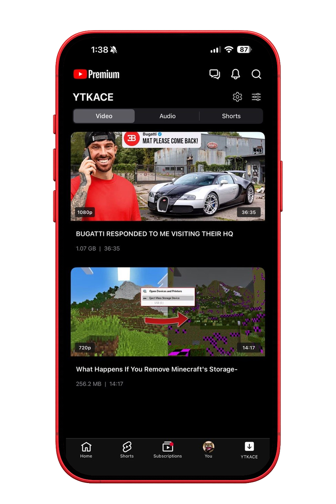
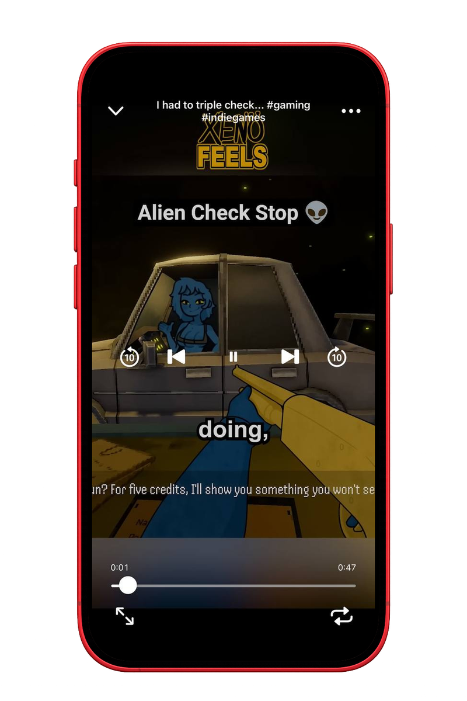
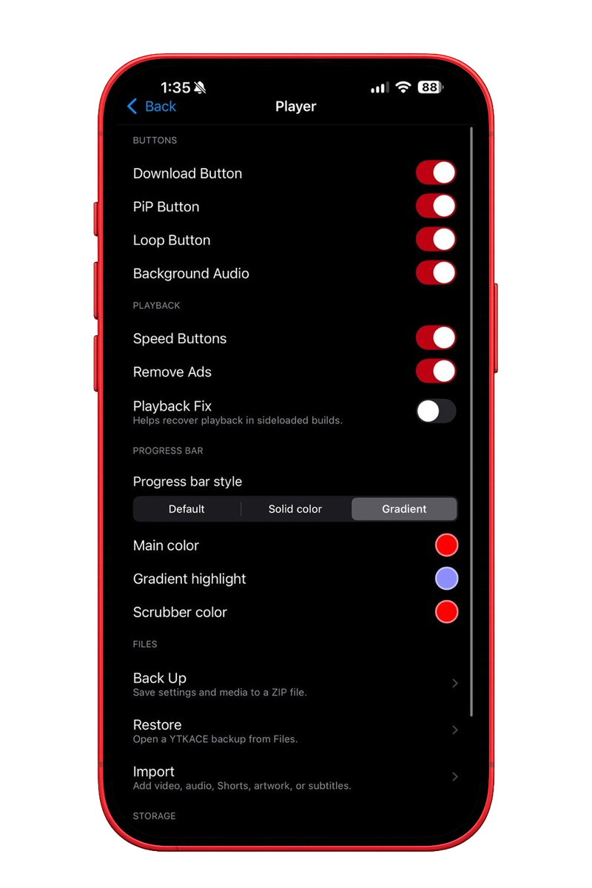

# YTKACE

An open-source YouTube enhancement for iOS.

## Features

| Area | Included |
|---|---|
| Downloads | Video, audio and Shorts downloads; queues; sorting; backup and restore |
| Playback | Background playback, PiP, loop, speed controls, gestures and tap to seek |
| SponsorBlock | Category controls, progress markers, skip modes and configurable alerts |
| Interface | OLED mode, overlay controls, navigation cleanup and native share sheets |
| Tabs | Hide, reorder and add YouTube destinations |
| Library | Downloaded video, Shorts and audio players with resume support |

## Compatibility

- **iOS:** 16.0 and newer
- **Architecture:** arm64
- **Latest confirmed YouTube:** 21.30.5
- **YTKACE:** 0.8.0

The same injected IPA can be installed with TrollStore or a developer-certificate sideloader.

## Build

Fork the repository, enable Actions, open the **IPA** workflow and provide a direct link to a decrypted YouTube IPA you are legally allowed to use. The completed workflow provides the injected IPA as an artifact. The **Deb** workflow builds the tweak package.

## Settings

Open the YTKACE tab and tap the gear, or open YouTube Settings and choose YTKACE.

## Screenshots

  
  
  

  Settings · Downloads · Audio Player

  
More screenshots

   
  

    
    
    
  

  

    
    
    
  

  

    
    
  

## Privacy

YTKACE has no activation service, analytics, telemetry or updater.

## License

YTKACE source is available under the [MIT License](LICENSE). See [Third-Party Notices](THIRD_PARTY_NOTICES.md) for components and services with separate terms.
